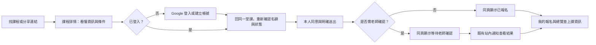

# 學員流程第二輪設計訪談

日期：2026-10-03（Asia/Taipei）

狀態（2026-10-09 Codex 收尾）：Q1–Q14 已確認；票 01、02、03、05 已完成且對應 commit 已包含於目前 main。票 04 已接回 main working tree，Webpack fresh build、164/164 smoke 與獨立 review APPROVE；尚未提交。票 06 維持未完成：第一輪 168/174 smoke 通過，修正測試後續跑 build 遭 Windows 路徑過長阻擋；短路徑已備妥但未執行。依產品主人要求，本輪停止自動重試與新增檢查，不 commit／push、不接續其他票；下一次工作僅限「使用短路徑完成票 06 驗收」。最新狀態、既有資源清理與證據限制以 `docs/superpowers/plans/member-flow-redesign/ticket-breakdown.md` 與票 06 末尾收尾紀錄為準；下方訪談與第一批 packet 保留為歷史，不將舊的「尚未開始」當成目前進度。

## 任務與方法

產品主人希望優化個人註冊、選課、參加團主團課與老師開課、查看詳細開課資訊的流程。目標為步驟精簡、畫面排版一致、操作順手、資訊容易找到且一目了然。

依 `.claude/skills/grill-with-docs/SKILL.md`，搭配 `grilling` 與 `domain-modeling` 分輪訪談。每輪只問前置決策已清楚的問題；區分 repo 事實、Codex 建議、產品主人決策。使用者確認共同理解前，不進入產品實作。

本文件記錄本次討論，不覆蓋 `docs/member-usability-plan.md` 既有定案。新的選項只有在產品主人明確回答後才成為決策。名詞沿用 `docs/context/glossary.md`：介面稱「學員」，兩種來源為「團主團課」與「老師開課」，identifier 維持英文。

## 已知現況與證據

- 前一輪以分享連結報名為主線，Google 登入不增加其他必填註冊資料；登入回原課程後由學員明確送出報名，不自動報名。見 `docs/member-usability-plan.md` 決策 1–4。
- 學員外框、共用報名狀態、詳情頁名額與取消、課程列表篩選、報名清單與總覽已有實作。見 `src/app/member/`、`src/app/classes/` 與 `docs/superpowers/plans/member-usability/tickets/`。本次仍須檢查實際使用體驗，不能把「已有功能」等同於 usability 已驗收。
- 票 07 記錄站內流程為課程詳情 → 登入頁 → 回原詳情並報名，另有 Google 的帳號畫面。測試模擬 Google 登入完成，不等於本輪驗證真實 OAuth。見 `docs/superpowers/plans/member-usability/tickets/07-enroll-flow-end-to-end-verification.md`。
- `ClassSession` 目前沒有價格欄位。未提供價格不能解讀為免費；費用如何呈現仍待本輪判斷是否納入討論。見 `docs/domain/data-model.md` 與前一輪決策 8。
- 既有系列由獨立 `ClassSession` 場次組成，報名單位是單場。沒有因本次提出「選課」就授權整期報名或套票。見 `docs/domain/data-model.md` 的 `RecurringClassSeries`。
- 公開列表與訪客詳情有公開條件；登入學員的既有分享連結讀取模式另有邊界。優化入口不能自行放寬非公開課程資訊。見 `docs/domain/permissions.md`、`docs/product/route-map.md`。

## 本輪靜態盤點發現（尚未實作修正）

| 已查證程式事實 | Usability 影響或待驗證情境 |
| --- | --- |
| `src/app/classes/page.tsx` 目前篩選為課程風格、星期幾與只看還有名額；沒有日期範圍、地點或瑜伽類型篩選。`public-read-service.ts` 預設未排除已開始場次，按開始時間升序。 | 主動找課是否需要不同條件須由產品主人決策；過期但仍開放狀態的場次可能干擾結果。此為程式推論，本輪沒有讀取實際課程資料驗證頻率。 |
| `requiresApproval` 決定報名為 `pending` 或 `confirmed`，目前兩種詳情 DTO 都沒有帶此欄位，表單按鈕一律為「確認報名」。 | 學員可能送出後才知道需要老師確認；可討論先告知此條件，保留現有狀態機。 |
| 訪客的「登入後報名」位於完整課程說明之後；登入後的既有報名狀態亦在課程說明後。 | 長內容可能把下一步或報名狀態推離第一屏；需以長標題、長說明、手機尺寸與文字放大驗收，不能只靠短測試資料宣稱首屏達標。 |
| 「待你處理」包含「等老師確認」，共用 `pending` 標籤為「處理中」。 | 等待他人與學員現在要做的事可能混淆；後續討論狀態文案與區塊區分。 |
| 公開讀取允許 `open_for_enrollment`／`confirmed`；登入詳情讀取允許 `open_for_enrollment`／`completed`。 | 靜態分支不一致：符合公開條件的 `confirmed` 課程可能在登入後變成 404。尚未做 UI／DB 重現；後續須先確認既有 contract 與實際狀態使用，不自行擴權修正。 |

這些是本輪訪談的依據，不代表已核准新增篩選、公開老師頁面、價格欄位或改動課程可見性。

第二輪補充查證：

- 老師建課目前只有選填 `description`（最多 2000 字），可改善輸入提示但無法可靠拆出舊文案的適合對象與準備事項。見 `src/app/teacher/classes/new/_components/ClassSessionCreateForm.tsx:840` 與 `prisma/schema.prisma` 的 `ClassSession`。
- 地點為自由文字，可作關鍵字篩選；現有日期與 `yogaStyles` 可支援篩選，但地點不保證縣市／行政區標準化，團主媒合課的瑜伽類型亦可能為空。篩選語意須定義，不能補猜資料。
- `TeacherProfile` 已有介紹、年資等資料，但課程 DTO 只提供名字，尚無公開老師詳情 route。師資公開介紹須另定公開欄位，不能直接暴露本人／管理員 DTO。
- 現有 callback sanitizer 靜態保留站內路徑及錨點，但目前登入回跳未使用 `#enroll`，真實 Google OAuth 帶錨點返回仍待驗證。見 `src/lib/auth/callback-url.ts`、`src/app/sign-in/page.tsx`。
- `basicConsent` 是表單與 domain 必須驗證的報名條件，core 會寫入 `consentedAt`；不能為減少步驟而省略或預勾。見 `src/app/classes/[classSessionId]/page.tsx`、`src/domain/enrollment/validation.ts` 與 `src/domain/enrollment/__internal__/create-enrollment-core.ts`。

## 決策樹

```text
目標：學員找得到課程、看懂資訊、順暢報名與參加
├─ Q1 主線：第一次主動找課；分享連結與回訪保留 [已確認]
│  ├─ Q4 找課預設與必要篩選 [已確認] → Q10 篩選語意與返回列表 [已確認]
│  └─ Q7 報名後與上課前的入口 [已確認] → Q13 不可報名與不可查看情境 [已確認]
├─ Q2 範圍：納入深層改善方案，具體決策後才做 [已確認]
│  ├─ Q6 登入與註冊接續 [已確認] → Q12 登入失敗與名額變動 [已確認]
│  └─ Q9 取消重報與整期報名的範圍取捨 [已確認：另案處理]
└─ Q3 優先資訊：時間地點、適合程度、名額與本人狀態 [已確認]
   ├─ Q5 詳情頁層級與一致排版 [已確認] → Q14 驗收與實作分批 [已確認]
   └─ Q8 適合程度與準備事項的資料缺口 [已確認] → Q11 最小欄位與資料影響 [已確認]
```

「已確認」代表產品方向已採納，實作仍須完整規格與共同理解確認；後續每輪依已回答的分支重算問題。

## 第一輪問題與建議

### Q1：主要學員情境

- A：第一次來、尚未選定課程，找課 → 看懂資訊 → 登入／註冊 → 報名。
- B：收到分享連結，看詳情 → 登入／註冊 → 報名。
- C：已報名的回訪學員，快速查下一堂課、地點與報名狀態。
- Codex 建議：A 作主線，B 保留捷徑，C 作報名後延續。前一輪以 B 優先，需確認本輪是否改變主線。
- 產品主人回答：2026-10-03「1 照你的建議」，採 A；B 保留捷徑，C 作報名後延續，於目前 task 接續。

### Q2：本次討論邊界

- A：沿用 Google 登入與單堂報名規則，優化資訊與排版。
- B：亦討論登入捷徑、報名／取消規則等深層改善，列出方案與影響後再決策。
- Codex 建議：B；允許討論不等於授權變更 Auth、schema、permissions 或 state machines。
- 產品主人回答：2026-10-03「照你的建議」，採 B；仍須確認具體方案及實作邊界。

### Q3：看完課程頁，最優先要能解答的問題

請選最多三項：

1. 何時、在哪裡上課，如何抵達。
2. 課程內容、強度，是否適合新手或自己。
3. 老師是誰、教學特色與可信度。
4. 費用、如何付款、取消條件。
5. 剩餘名額、是否需老師確認、目前是否報名成功。
6. 單堂／系列的差別，這次報名哪一天。

- Codex 建議：1、2、5 為主要資訊層級；費用為已知資料缺口，不能顯示成免費。
- 產品主人回答：2026-10-03「照你的建議」，採 1、2、5。

## 第二輪 Harness Preflight

- Task type：設計訪談、docs、public UX／core user flow 規劃。
- Workflow mode：PLANNING_ONLY；本輪文件更新為 low risk，但候選實作涉及 medium／high risk。
- Automation boundary：允許 read-only 查證與本文件更新；未授權產品 Builder。
- Risk flags：AUTH_RISK（登入捷徑）、PRISMA_RISK／MIGRATION_RISK（若新增課程欄位）、PERMISSION_RISK（若改公開資料）、STATE_MACHINE_RISK（若改取消重報）、BRAND_RISK／LOW_PRESSURE_UX_RISK（名額、狀態與 CTA 呈現）。這些為候選風險，非已批准變更。
- Human gate／Auto Builder Decision：具體方案與共同理解待確認；Can auto-enter Builder = no。
- Relevant docs／files：前一輪列出的學員計畫、scope／domain／route map、Harness 工作流程，以及 `src/app/classes/`、`src/app/member/`、`src/app/sign-in/page.tsx`、`src/lib/auth/callback-url.ts`、課程公開讀取與報名 service；另查老師建課與 schema 的可用資料。
- Allowed files：只更新 `docs/member-flow-redesign-plan.md`，記錄已確認答案及待決策選項。
- Forbidden writes：產品 source／tests、Auth、Prisma／migration、domain contract、其他角色計畫與既有未提交變更、package／env／deployment。
- Working tree：`main...origin/main`，有其他進行中的文件變更；本文件原為本 task 新增的 untracked 檔案，沿用它記錄。保留其他檔案，不 stage／commit／push。
- Next smallest actionable slice：確認 Q4–Q9，收斂找課預設、詳情層級、登入銜接、上課前入口與資料／政策邊界。
- Verification：文件回讀、新文件 whitespace check、參考檔案存在性與 Git 範圍檢查；尚無產品修改，不跑 build／unit／E2E。

## 第二輪問題與建議（已回答）

### Q4：找課預設與篩選

建議預設以未來可參加的公開課程為主，依時間由近到遠排列；已開始場次不混在主列表，額滿課可透過條件切換查看。先提供日期／時段、地點關鍵字、瑜伽類型，課程風格放次要條件；兩種課程來源仍在同一列表。

取捨：比目前更容易找到可參加的課，但改變預設查詢結果。地點只有既有自由文字，不承諾距離排序或 GPS；可選項與精確篩選語意須於選定方向後另行定義。維持公開條件，不把非公開團課加進搜尋。

產品主人回答：2026-10-03「1, 都照建議」，採納 Q4；於目前 task 接續。

### Q5：詳情資訊與一致排版

建議頂部固定資訊順序：課名與來源 → 時間／地點／老師 → 名額、是否需老師確認與本人狀態 → 主要操作。中段為課程介紹與適合對象；下段為準備事項與取消說明。已報名時頂部改為本人狀態與上課資訊。手機保留容易找到的操作區，避開鍵盤、safe area 與內容遮擋；各學員頁沿用共用外框、標題、卡片與間距。適合對象與準備事項的資料方案須依 Q8 答案定義，不在本題假定已有內容。

取捨：細節向下展開，首屏以決策摘要與下一步為主；不承諾任意長內容都能在同一屏完整顯示。

產品主人回答：2026-10-03「1, 都照建議」，採納 Q5；實際資料內容依 Q8 與後續 Q11 定義。

### Q6：登入與註冊銜接

建議課程頁的「使用 Google 登入／註冊後報名」直接開 Google，省略只有單一 provider 的中間登入頁；明示首次會建立帳號。完成後回同一堂課的報名區，由學員確認既有同意事項並明確送出，仍不自動報名。保留全站 `/sign-in` 入口與失敗重試路徑。

取捨：減少一個站內畫面，但涉及 Auth action、callback 安全、失敗／取消的回復與真實 OAuth 驗證；未來增加 provider 時需重新檢視。這是方案建議，沒有執行授權。

產品主人回答：2026-10-03「1, 都照建議」，採納 Q6 的直接 Google 登入方向；錯誤回復與驗證方式於 Q12 收斂，尚未進入 Auth 實作。

### Q7：報名後與上課前入口

建議送出後留在同一詳情頁，頂部明確區分「已報名」與「等待老師確認」，後者說明無需重複送出，結果查看既有站內通知。提供「我的報名」入口；回訪的「我的總覽」先顯示下一堂已確認課的時間、地點與詳情入口，再顯示待自己操作的事項。等待老師確認另列為等待結果，不混在「待你處理」。

取捨：只調整資訊與用詞，不承諾新增 email、未讀數、精準通知連結、提醒或老師回覆期限。

產品主人回答：2026-10-03「1, 都照建議」，採納 Q7。

### Q8：適合程度與準備事項的資訊來源

建議先規劃「適合對象／程度」與「準備事項」為老師可選填的課程資訊，讓學員直接讀到老師提供的內容；舊課未填時清楚表示未提供，不依瑜伽類型或課程風格自動猜測。這會牽涉老師建課表單、單堂／系列資料與公開 DTO，需列出新增欄位、migration 及公開內容邊界後確認，另切實作。

另一方案：本輪完全不新增欄位，沿用既有說明，但不能保證每堂課都能回答是否適合新手與要帶什麼。選定新增資訊方向不等於放行 schema／migration。

產品主人回答：2026-10-03「1, 都照建議」，採納 Q8 的兩項選填資訊方向；schema／migration 與建課影響於 Q11 收斂，尚未執行。

### Q9：取消重報與系列報名的範圍

建議本輪先維持單場報名與既有取消規則：清楚顯示這次報名的日期，並在取消確認時明示「取消後無法再次報名此課程」。取消後可重報、一次報整期另列獨立政策議題，先不與本輪資訊與操作改善混在一起。

取捨：控制本輪狀態機與容量計算的影響範圍，但保留取消不可重報的摩擦。若產品主人認為此限制必須本輪處理，下一輪須討論名額、老師再次確認與重報資料語意。

產品主人回答：2026-10-03「1, 都照建議」，採納 Q9；本次不修改取消重報或整期報名政策。

## 第三輪問題與建議（已回答）

本輪沿用已確認的 Q1–Q9，不重新要求批准這些方向。僅收斂尚未決定的篩選語意、資料影響與例外體驗。

### Q10：篩選與返回找課列表

建議日期提供不限／今天／未來 7 天／未來 30 天及自訂起訖；以 Asia/Taipei 判斷日期，預設不限日期但限未來可報名場次。時間提供不限／上午（00:00–12:00）／下午（12:00–18:00）／晚上（18:00–24:00），依開課時間比對。地點用關鍵字，瑜伽類型單選；風格、星期與「包含額滿」放更多條件。不同維度取交集，未標瑜伽類型的課仍出現在不限類型的結果。

篩選套用與清除要明顯；點進詳情再返回時保留條件，零結果提供清除條件的入口。地點輸入以明確套用／Enter 查詢，避免每個字都觸發刷新；不增加 GPS 或縣市資料分類。

產品主人回答：2026-10-03「1 都照你的建議」，採納 Q10；於目前 task 接續。

### Q11：兩項新增資訊與舊資料

建議為 `ClassSession` 與 `RecurringClassSeries` 各新增兩個 nullable 短文字欄位：`suitableFor`（適合對象／程度）及 `preparationNotes`（準備事項），各最多 500 字，由老師選填。空字串 trim 後視同未提供；不做新的等級 enum，也不依類型推斷內容。系列生成時複製到各場次，只有實際場次可報名；沿用目前系列場次的 `isPublic = false`，不順帶改可見性。

舊課與團主媒合課維持空值，詳情清楚顯示「尚未提供」；不改造舊 description 或自動補內容。老師建課表單新增同一個選填區，不增加步驟。只支援建立時填寫；本次不增加建課後編輯或團主建課表單欄位，避免把既有課程變更與通知政策一起引入。

這是 additive schema 方案，會影響資料模型文件、Prisma migration、老師單堂／系列建課與生成核心、兩種課程詳情 DTO；migration 在獨立核准的 Builder slice 規劃與驗證，不在訪談階段套用。

產品主人回答：2026-10-03「1 都照你的建議」，採納 Q11 的欄位、相容與既有課程限制；本輪只整理方案，不執行 migration。

### Q12：登入失敗與報名名額變動

建議使用者取消或登入失敗時，提供返回原課與重試，不送出報名；登入成功後回原課並重新讀取報名條件。若途中額滿、開始上課或已不可報名，顯示當下可安全揭露的結果與「找其他課程」，不表示先前查看已保留名額。

保留個別 server-side 報名驗證、本人同意、pending＋confirmed 容量計算與重複送出防護。安全 callback 只接受站內允許路徑；真實 OAuth、取消與錯誤返回需獨立驗證，不能以 session 模擬取代。

產品主人回答：2026-10-03「1 都照你的建議」，採納 Q12。

### Q13：不可報名與不可查看的區分

建議能合法查看但已額滿／已開始時，詳情仍呈現資訊並明確說明不能報名的原因。訪客遇到非公開課程、或任一身分遇到草稿／不符既有讀取條件時，沿用現有 not-found 邊界，不透露課名、老師審核狀態或內部原因，提供返回找課的出口。登入學員既有透過連結查看非公開課程的能力保持不變；不把訪客的 `isPublic` 限制套到登入者。

本人既有報名仍從「我的報名」查看允許的時間、地點與狀態；課程 `cancelled` 的卡片保留自有資訊，移除通往不可讀詳情的整卡連結。已取消的是本人報名而非整堂課時，不因此一律移除連結，仍依課程可讀條件處理。使用既有 own-scoped 資料，不為此放寬公開或他人讀取權限。公開／登入 `confirmed` 分支不一致先獨立驗證與界定修正，不直接改 allowed status。

老師資格已暫停時，既有報名仍保留；訪客沿用目前 not-found，登入學員維持既有可讀課程資訊。新報名仍由 service 拒絕，不把暫停理由公開。若第一批要提前隱藏不可送出的 CTA，須另定窄的「是否能接受新報名」衍生資訊與 security review，不直接把老師內部狀態 DTO 公開。

產品主人回答：2026-10-03「1 都照你的建議」，採納 Q13；不放寬課程可見條件。

### Q14：Usability 驗收與分批

建議將找課／詳情／我的報名的 UI 與既有資料改善作第一批，Auth 捷徑與兩項欄位各作獨立後續 slice；每批有具體畫面與檢查結果，最後串完整流程。第一批尚未有新欄位時依既有課程說明呈現，不假裝已有獨立資訊。

驗收至少涵蓋手機 375／390 寬與桌機、長標題和 2000 字說明、200% 文字放大、鍵盤操作、固定操作區不遮擋內容、篩選返回保留、直接確認／待老師確認、零結果、額滿、登入失敗與取消、登入回來課程已不可報名。

步驟目標：既有登入學員由列表 → 詳情同頁送出（不另建確認或成功頁）；訪客由詳情 → Google → 同一詳情確認送出（直接登入捷徑完成後）。這是互動步驟與回跳的驗收，不要求任意長內容都在第一屏完整顯示，不省略本人同意與 Google 外部畫面。

產品主人回答：2026-10-03「1 都照你的建議」，採納 Q14。執行順序收斂為第一批 UI／既有資料、第二批新增資訊、第三批 Auth 捷徑。

## 第三輪實作影響查證

- 新欄位鏈：`prisma/schema.prisma` → 單堂與系列 validation → 老師表單／actions → 單堂 create core／系列 create service → 逐場生成 core → 公開與學員 DTO／詳情。系列與單堂需完整同步，團主路徑維持選填相容。
- 新欄位不提供建課後編輯；現有老師詳情已明示建立後無法修改，系列 action 亦沒有內容 update。這是本輪刻意保留的限制，不承諾舊課可以補填。
- 課程取消仍保留時間地點並連帶取消有效報名；我的報名查詢按本人 userId，不篩課程／老師狀態，因此保留歷史資訊。詳情則排除 `cancelled`，整卡連結目前會導到 404。老師暫停不取消既有課／報名，登入詳情亦未篩老師狀態。以上為靜態查證，未讀 DB 或重現 UI。
- 可用程式 checks：`npx tsc --noEmit`、`npm run lint`、`npm run build`；schema slice 增加 `npx prisma validate`、client generation 與 migration 審核。Smoke 用獨立 `PORT=3100`，先 build，再執行關聯 spec。
- Smoke 會建立／刪除共享 PostgreSQL fixture，不能與其他 task 的 build／DB 測試混跑；需確認互不干擾的驗證環境。現有 package 沒有 Vitest／unit script，不宣稱 unit gate 已具備。
- Auth slice 要保留真實 Google OAuth 的手動驗證；模擬 session 只能驗證站內接續。若真實登入需要產品主人操作 Google 帳號，就明確列為尚未完成的驗收，不預先宣稱通過。

## 收斂後的共同理解

本節為 Q1–Q14 的整合規格；前述問題保留為決策歷史。訪談 frontier 已無未決產品分支，剩下的是確認整份規格可作為實作依據。以下描述的是目標行為，不能解讀為已上線功能。

### 完整學員旅程



第一批訪客仍經既有登入頁；第三批完成後才由課程頁直接前往 Google。這個暫時差異必須在驗收報告明列，不能提前宣稱最終減步已完成。

| 畫面／入口 | 學員要完成的任務 | 固定資訊層級與下一步 |
| --- | --- | --- |
| `/classes` 找課程 | 找到時間、地點與瑜伽類型合適的課 | 精簡篩選 → 結果數／已選條件 → 課程卡。卡片包含課名、日期與星期、時間、地點、老師、來源、名額、需確認提示；整卡為「查看課程」。 |
| `/classes/[classSessionId]` 詳情 | 判斷能否參加、看懂報名結果預期 | 摘要與本人狀態 → 報名區 → 課程介紹 → 適合對象／準備事項 → 取消限制。長說明不把摘要、主要操作或本人狀態推到頁尾。 |
| 登入／註冊銜接 | 建立基本學員能力並回到原課 | 只使用既有 Google；首次自動建帳號，不加個人資料表單，不自動送出報名。 |
| 報名完成 | 確認自己是否已成立報名 | 留同頁，成功回饋加上資料庫實際本人狀態；提供「查看我的報名」。等待確認不寫成報名成功。 |
| `/member/dashboard` 我的總覽 | 找到下一堂上課資訊與需要自己做的事 | 下一堂已確認課 → 其他即將上課 → 待你處理 → 等待老師確認 → 近期通知。待評價可沿用既有功能，純等待不列為需要自己動手。 |
| `/member/enrollments` 我的報名 | 查看即將上課、等待結果與歷史紀錄 | 即將上課依開始時間升序；過去與已取消另列。每張卡直接看到時間、地點與本人狀態。整堂取消的卡不導到不可讀詳情。 |

沿用既有首頁／導覽的找課入口，不在本批重做品牌首頁、角色切換或老師公開介紹頁面。所有登入者仍以同一 User 的基本 Member 能力參與，不新增 MemberProfile 審核。

### 找課查詢 contract

- 預設：只呈現未來、目前開放報名且有名額的公開課程，近期優先。名額按 pending＋confirmed 計算；額滿可切換包含。已開始的場次不因包含額滿而回到主要結果。
- 公開 eligibility 原條件保持；只對已可公開讀取的集合增加查詢／展示篩選，不新增任何可讀狀態或揭露非公開團課。
- 「不限日期」不限制未來範圍；「今天」為台灣當天剩餘可報名時間；「未來 7／30 天」包括今天，以台灣當日 00:00 起算 N 個 calendar days 的區間，再排除 `startAt <= now`。
- 自訂日期採包含起訖日；下層查詢轉為起日 00:00 至訖日翌日 00:00 的半開區間。逆序、無效日期不默默當成不限，要提示修正。
- 時段按台灣開課時間判斷，上午 `[00:00,12:00)`、下午 `[12:00,18:00)`、晚上 `[18:00,24:00)`；不以整段課程是否跨時段來排除。
- 地點為 trim 後文字包含比對；瑜伽類型以既有標籤精確比對，不自動把風格當瑜伽類型。可選類型沿用既有清單／符合公開條件的類型資料，不讀私人老師擅長資料。舊課空類型在不限時仍可見。
- 風格、星期、包含額滿放更多篩選；不同維度取交集，篩選與清除使用正常 form／可鍵盤操作的控制項。
- 可分享的站內 query 為條件來源；列表 → 詳情 → 登入返回／報名回饋 → 返回找課需保留原條件。返回目標只允許 `/classes` 與經驗證的篩選 query，不能接受外部 URL 或其他敏感 route。
- 暫不新增課名全文搜尋、距離推薦、GPS、分頁系統或地點分類資料模型。

### 課程與本人報名的畫面狀態

| 可讀與報名條件 | 顯示與操作 |
| --- | --- |
| 訪客、課程可公開讀且可報名 | 摘要即告知需不需要老師確認；第一批連既有登入頁，第三批直接 Google。 |
| 已登入、無既有報名、可直接成立 | 顯示「確認報名」，送出前保留未預勾的本人同意。 |
| 已登入、無既有報名、需老師確認 | 顯示「需老師確認」與「送出報名申請」，先告知送出不等於成立。 |
| 本人 `pending` | 頂部「等待老師確認」，說明已送出、無需重複操作；開始前可沿用既有本人取消。 |
| 本人 `confirmed` | 頂部「已報名」及上課摘要；開始前可沿用既有本人取消。 |
| 本人 `cancelled`、課程仍可讀 | 顯示已取消與不可重報限制，不顯示新的報名表單。 |
| 可讀但額滿／已開始／不能接受新報名 | 保留允許資訊，不能送出的操作不表示可報名；提供找其他課程的出口。 |
| 整堂課 `cancelled` | 詳情沿用目前 not-found；本人在我的報名看原時間地點與取消狀態，卡片不連到不可讀詳情。 |
| 不存在／不符既有可讀條件 | 同樣 not-found 與返回找課；不以訊息揭露非公開課、草稿、老師內部狀態或取消理由。 |

資格顯示可使用從現有可讀課程衍生的安全 boolean，但不新增權限、不暴露老師的審核／暫停原因；最終報名仍由既有鎖與 service 驗證。`confirmed` 課程公開可讀但登入不可讀的靜態差異保留為獨立待驗證項，不透過本批更改 detail WHERE 來解決；第一批找課預設只顯示實際開放的新報名課程，也不能宣稱此差異已修復。

### 排版與手機操作

```text
找課程                         課程詳情
共用導覽                       共用導覽
標題＋簡短說明                 返回找課程（保留條件）
日期／時段／地點／瑜伽類型     課名＋來源
更多條件／套用／清除           時間／地點／老師／名額
結果數／已選條件               需確認提示／本人報名狀態
一致的課程卡片                 主要操作／同頁報名區
空狀態與清除入口               介紹／適合對象／準備事項
                               取消限制
```

- 登入前後學員頁主內容以 `max-w-4xl` 為一致上限，保留適合閱讀的行長；沿用 pine、cream、既有角色外框與卡片，不發明新的品牌系統。
- 標題、間距、資訊標籤與狀態元件共用；手機單欄，桌機可兩欄摘要，但閱讀與操作順序不變。
- 說明完整保留，優先資訊不藏在 accordion。備註可維持選填，不增加新的確認畫面。
- 手機主要操作可固定在容易找到的位置，但要預留底部空間與 safe area，不能蓋住同意欄、表單錯誤或取消操作；文字放大／鍵盤彈出時需可捲動到全部內容。先將固定按鈕用作定位到完整報名區，不省略同意而直接送出。
- 單一主要 CTA，取消使用次要視覺；名額只呈現實際數字，不加倒數、搶購或稀缺壓力文案。
- 日期同時提供日期、星期與時間；維持地點原文，不自動捏造地址、地圖、交通或聯絡方式。

### 分批與完成定義

| 批次 | 成果 | 本批凍結邊界 | 完成／驗證 |
| --- | --- | --- | --- |
| 1：UI 與既有資料 | 找課篩選、摘要與主要操作、需老師確認預告、狀態分區、取消課卡片出口、一致版面 | 不動 Auth provider/session、Prisma、寫入 service/core、取消／重報、detail 可見條件、其他角色頁 | TypeScript／lint／build；相關 smoke；手機、長內容、文字放大、鍵盤、返回條件、pending 與 consent。 |
| 2：課程資訊 | 兩 model 的 nullable `suitableFor`／`preparationNotes`，老師建課同頁選填，逐場生成複製，窄 DTO 與讀取呈現 | 不做舊資料推測回填、建課後編輯、團主表單擴充、系列公開性或新老師公開頁 | 獨立完整 Builder prompt、資料模型同步、schema/client 檢查、migration review、單堂／兩種系列／舊課與團主相容 smoke；不自行套用真實 DB migration。 |
| 3：Auth 捷徑 | 課程 CTA 直接 Google、首次建帳號說明、原課返回、失敗／取消／條件變動接續 | 不新增 provider、帳號連結策略、角色、註冊必填欄、登入後自動報名 | 獨立完整 Builder prompt、Auth／permissions 說明同步、callback security review、站內 smoke 與真實 OAuth 手動驗收。 |

第三批後才驗收最終完整減步。第一批沒有新的結構欄位，只呈現老師已填的說明；缺資料不得假裝有資訊。第二批後缺值區塊顯示「尚未提供」。費用、支付、公開老師介紹、取消重報與整期報名均不在這三批內；缺價格不表示免費。

檢查與 self review 均不取代產品主人看畫面。每批報告具體已完成／未完成、diff 與驗證限制，未完成的後續批次不列為已完成。

### 第一批 Builder Prompt（已核准，保留原 draft）

本段符合 `docs/harness/ai-runs-current-templates/03-approved-builder-prompt.md` 的欄位要求。產品主人於完整方案 handoff 選擇「1」後，成為第一批 Builder 授權；原 prompt 留存供 review。完整計畫不是第二、三批實作或真實 DB migration 的自動授權。

```text
請依 docs/harness/ai-runs-current-templates/03-approved-builder-prompt.md 執行第一批 Builder。

Approved goal:
依 docs/member-flow-redesign-plan.md 的「收斂後的共同理解」，完成學員找課／詳情／我的總覽／我的報名的 UI 與既有資料讀取改善。本次只做第一批；不把第二、三批功能混入。

Automation / risk:
Approved Builder candidate；medium risk（查詢與核心 UI flow），取得此 prompt 執行確認後，在下列 scope 內 build → test → self review → report。不自動 commit／push。

Allowed source files（僅必要者）：
- src/app/classes/page.tsx
- src/app/classes/[classSessionId]/page.tsx
- src/app/classes/[classSessionId]/actions.ts（只調整保留查詢返回的導覽參數與 redirect，不改 service 呼叫或報名／取消寫入語意）
- src/app/classes/[classSessionId]/not-found.tsx（可新增統一且不洩漏資訊的返回找課出口）
- src/app/classes/_components/ClassAvailabilityBadge.tsx
- src/app/classes/_components/ClassFilters.tsx（可新增）
- src/app/classes/_components/ClassSummary.tsx（可新增）
- src/app/classes/_components/ClassEnrollmentPanel.tsx（可新增）
- src/app/member/_components/MemberTodoList.tsx
- src/app/member/_components/EnrollmentStatusBadge.tsx
- src/app/member/dashboard/page.tsx
- src/app/member/enrollments/page.tsx
- src/domain/class-session/public-read-service.ts
- src/domain/class-session/class-discovery-filters.ts（可新增純查詢參數／Taipei 時間／篩選 helper）
- src/domain/enrollment/read-service.ts（type/select/DTO additive，只回傳既有合法資訊與安全衍生 boolean，不改本人或 detail 可見範圍）
- src/lib/navigation/class-return-path.ts（可新增，只接受 /classes 與已知篩選 query）

Allowed tests / docs：
- tests/smoke/public-classes-discovery.spec.ts
- tests/smoke/enrollment.spec.ts
- tests/smoke/enrollment-approval.spec.ts
- tests/smoke/member-dashboard.spec.ts
- tests/smoke/class-discovery-filters.spec.ts（可新增純函式邊界驗證，不安裝測試套件）
- docs/member-flow-redesign-plan.md
- docs/member-usability-plan.md（只追加第二輪實作與對前一輪決策的補充，不改寫歷史驗收）

Forbidden areas:
- Auth config/provider/session/callback helper、sign-in 頁、proxy、Prisma schema/migrations、package/lock、env、deploy。
- 所有報名／取消／建課 write service、core 與 state transition。
- 角色／permissions model、公開或登入 detail 的 allowed status、isPublic 邊界、teacher approval 規則。
- 老師、團主、管理員頁、共享 global CSS／公開 header／role shell；其他工作已有變更。
- docs/domain/*、docs/product/route-map.md、其他角色 docs，除非另有明確授權。
- Payment/email/notification 能力、新欄位、老師公開 profile、新 route capability、整期報名、取消重報。

Implementation requirements:
1. 查詢／時間／permission 衍生判斷放 helper/read-service，不堆到 page；先釐清現有使用者與 DTO，保留 detail WHERE 與 own-scope。
2. 找課預設為未來、open_for_enrollment、有名額；包含額滿只放寬名額條件。公開安全條件固定，confirmed 詳情差異另記未處理，不增可讀狀態。
3. 依本計畫加入日期／時段／地點／瑜伽類型，保留更多風格／星期；條件可分享、清除、返回保留，無效日期有明確錯誤。
4. 列表卡片為查看詳情，不在列表直接建立報名。名額與是否需老師確認使用既有欄位，不做價格或師資資料擴充。
5. 詳情先摘要／本人狀態／主要操作，再課程說明；兩種來源與兩種報名條件的排版共用，明示需老師確認，pending 改「等待老師確認」。
6. 第一批訪客仍經 /sign-in；callback 仍走既有安全 helper。原列表返回 context 只做站內合法導覽，不改登入行為、不自動報名。
7. 未預勾 basicConsent、備註選填、原容量／duplicate/cancel checks 保留；service 為最終權威。固定操作區僅定位到同頁報名表單，不繞過驗證。
8. 總覽先上課資訊；MemberTodoList 依既有 kind 分「待你處理」與「等待老師確認」，不改 domain todos 條件。
9. 整堂 cancelled 卡保留自有時間地點、取消狀態，移除失效詳情連結；本人取消但課程可讀不一律移除連結。
10. 安全衍生 boolean 可用來停止顯示不能送出的 CTA，但不能把老師審核／暫停 status/reason/id 暴露到公開 DTO，也不改 service 能力；完成 security self review。
11. 沿用品牌與角色導覽；訪客/登入的學員主內容上限一致；long copy、RWD、keyboard/focus、safe area 不遮擋。
12. 同步允許的中文計畫文件；新增結構資訊與直接 Google 為後續，報告明列未完成。

Checks:
- git diff --check、npx tsc --noEmit、npm run lint、npm run build。
- 在確認沒有其他 task 重新 build/跑共享 DB fixture 的情況下，以 PORT=3100 執行關聯 Playwright smoke：public-classes-discovery、enrollment、enrollment-approval、member-dashboard、signed-in-navigation；純 filter 測試依新增檔案執行。
- 保留 consent／不自動報名／pending 佔名額／本人取消／訪客與非公開邊界的實質斷言，不只更新文字斷言。
- 手機 375/390、桌機、長標題/2000 字說明/長地址、200% 文字放大、鍵盤、固定區與表單、零結果、自訂日期起訖/Taipei 午夜/12:00/18:00 邊界、篩選返回、pending/confirmed/cancelled。
- 不執行真實 Google OAuth、不接觸真實學員資料；只宣稱本站第一批已驗證。

Repo / concurrency:
先記錄 baseline status/diff，保留其他 task 的修改。本批 UI 檔案若已有他人未提交變更或必要檢查被共享 build/DB 干擾，先界定是否能隔離；無法可靠隔離則停止，不覆寫、回滾、清除或修復別人的工作。

Completion criteria:
上述第一批功能可在允許檔案內完成、checks 及 manual smoke 有明確證據；後續新欄位/Auth及 confirmed 可見性差異明列，不宣稱整案完成。

Stop conditions:
- 需要 forbidden files 或擴大 allowed list。
- 需要 Auth/schema/migration/permission/state-machine/write-service/core/其他角色變更。
- 無法安全保留其他 task 變更或可靠進行 checks；不得將干擾當成功。
- Check repair 會擴 scope；不得為了過測試刪除 permission/consent/domain 斷言。
- 需要 commit、push、deploy、真實 DB migration。

Output Report Requirement:
完成後請不要 commit / push，並回報：
1. Changed files
2. Full git diff（只包含本批變更，保留其他 task baseline）
3. Checks result 與未跑原因
4. Manual smoke result 與必要畫面證據
5. Self review
6. Scope drift check：是否有超出本批的修改或判斷
7. 未完成的第二、三批與 confirmed 可見性差異
8. Recommended Next Step，依 docs/harness/review-packet-spec.md Common Handoff Schema 填完整欄位。
```

### Recommended Next Step — 設計收斂 handoff

- Level：L3 Template Prompt Handoff。
- Recommended next work mode：共同理解／Product Owner Decision 確認後，第一批 Builder。
- Next smallest actionable slice：本文件的「第一批 Builder Prompt Draft」。
- Why this should be next：Q1–Q14 已收斂，先以既有資料完成最常使用的找課與報名畫面，再分開驗證 schema 與 Auth 風險。
- Can Codex execute directly：可完成 read-only preflight；完整方案與本批 prompt 確認後可執行第一批。第二、三批須另有完整範圍與檢查，不能自動接棒。
- Suggested execution location：current task，產品主人已多次選擇；也可明確要求 new task。
- Requires product owner decision：不重問 Q1–Q14；只需確認本完整方案為共同理解並啟動上述第一批 prompt。
- Suggested next prompt：完整可複製 prompt 即上一節 code block；執行確認將此 draft 作為第一批授權。
- Auto-continue allowed：設計查證／本文件 read-back = yes；產品 Builder = no，直到完整方案與第一批 prompt 確認。
- Auto-continue reason：沿用已批准的文件整理，產品程式尚不在本輪授權。
- Stop condition triggered：尚未進入產品 Builder；完整方案共同理解與首批範圍確認為 skill／Harness gate。
- Notify human：yes，本報告即通知。
- Notification reason：需確認具體、可 review 的首批結果要求，非重問既有選擇。
- Approval noise reduction applied：yes，不再逐項要求 Q1–Q14，也不另建 task。
- Approval boundary note：未改產品、Auth、schema、domain 文件或執行 migration；確認第一批不代表後續批次、commit／push／deploy 的授權。

### Domain Modeling 記錄

沿用「學員／團主團課／老師開課／課程風格／瑜伽類型」，沒有新的專案名詞需要覆寫既有 glossary。選填文字欄位與頁面排序可逆，未更換 Auth provider、architecture 或 marketplace state machine，因此本輪不另建 ADR；重要取捨與未做項目已記在本計畫。第二、三批實作時必須在同一變更更新對應 domain／engineering 文件。

## 工作與確認邊界

- 本輪允許查證事實、訪談與記錄本文件；不改產品程式、Auth、Prisma schema、角色權限、marketplace state machines、付款、通知與部署。
- 保持 V1 marketplace 範圍；不新增 Wellness／Academy／Retreat、AI matching、複雜付款／退款自動化或 native mobile app。
- 決策形成時再同步必要名詞；ADR 僅在難以逆轉、需要背景解釋且確有取捨時建立，不為每個排版選擇建立 ADR。
- 若討論要求改動 `docs/domain/` 的 domain 邊界，依 domain-modeling skill 先告知產品主人並具體說明影響。
- 開始時既有未提交變更為 `docs/admin-usability-plan.md`、`docs/backlog.md`、`docs/context/glossary.md`，本輪不覆寫這些變更。
- 後續檢查另見 `docs/teacher-usability-plan.md`、`docs/organizer-usability-plan.md` 與 `docs/specs/admin-usability-redesign-spec.md` 有其他工作變更，非本輪操作；保留原樣。本 task 唯一修改檔案為本文件。
- 不自動 commit 或 push。

## 本輪驗證與輕量 self review

- Changed files：本文件，記錄 Q1–Q14 確認、整合流程／畫面／查詢／狀態規格、分批與第一批 Builder Prompt Draft。
- 檢查：文件回讀、參考檔案存在性、Git 變更範圍與 `git diff --check`；不跑 build／unit／E2E，因本輪尚未修改產品程式。
- V1／角色／權限／狀態機／資料模型／route map：維持目前已實作 contract；未來欄位與 Auth 方案已依產品主人採納寫成目標規格，尚未修改 schema 或產品行為，不把規劃記成已落地。
- Security／RWD／brand：尚未做新 UI 實測；已列公開與登入讀取邊界，後續需用手機、鍵盤操作與溫和清楚的品牌文案驗收。
- Product owner decision：Q1–Q14 已確認，沒有新增未決產品問題；等待整合後共同理解與第一批具體 Builder scope 確認，不能自動進入第二／三批。
- Scope drift：本輪沒有修改無關檔案，保留開始時既有變更；無 commit／push。

## 第一批 Builder Review Packet — 2026-10-03

### Task request／Approved prompt

優化個人會員找課、查看團主團課／老師開課、註冊登入接續與報名，減少尋找資訊的負擔，維持一致、清楚、順手的畫面。產品主人採納 Q1–Q14，並在完整方案及第一批 prompt handoff 選擇「1」，授權本 task 執行上方第一批 Builder。第二／三批沒有執行授權。

狀態：第一批 UI／既有資料讀取已實作，驗收部分完成；相關 92 項案例經修正與分批重跑後，90 項通過，2 項角色返回案例仍失敗。不是整個三批方案完成或 final approve。

### Implementation summary

1. 找課改為同頁套用篩選，預設未來／open_for_enrollment／有名額，加入日期／時段／地點／瑜伽類型；更多條件與包含額滿保留，條件以 AND 組合，依開始時間升序。
2. 共用課程摘要／報名區，詳情先看時間、地點、老師、報名條件與本人狀態，再讀完整說明；需老師確認時先提示並使用「送出報名申請」。pending 顯示「等待老師確認」。
3. 列表 context 以安全的 `returnTo` 接續詳情、既有登入、報名與取消結果；限制為 `/classes` 與已知 query。訪客仍經 `/sign-in`，沒有自動報名。
4. 總覽先顯示即將上課與下一堂，再分本人待處理／等候／通知。取消整堂課的自有歷史卡保留資訊而移除失效詳情 link；本人取消但課可讀則保留 link。
5. `canAcceptNewEnrollments` 在窄 read-service 衍生，擋掉不能送出的 UI；不回傳老師內部 status/id，不改核心 enrollment service、權限、state transition 或 detail WHERE。
6. 手機入口只跳至完整表單，聚焦表單時隱藏，保留 safe area 與底部空間；長文字換行，訪客與登入詳情沿用一致頁寬。

### Changed files

| 檔案 | 變更 |
| --- | --- |
| `src/app/classes/page.tsx` | 統一列表、篩選、結果／空狀態、可返回詳情卡片。 |
| `src/app/classes/[classSessionId]/page.tsx` | 合併 Visitor／Member 排版、重排重點與操作、保留雙 read 路徑。 |
| `src/app/classes/[classSessionId]/actions.ts` | 僅導覽參數與 redirect 保留 context，原 write 呼叫不變。 |
| `src/app/classes/[classSessionId]/not-found.tsx` | 新增不揭露存在性差異的列表出口。 |
| `src/app/classes/_components/ClassAvailabilityBadge.tsx` | 安全 bool 為 false 時顯示中性不開放訊息。 |
| `src/app/classes/_components/ClassFilters.tsx` | 新增同頁 GET 篩選，選自訂立即顯示日期；明確 accessible name。 |
| `src/app/classes/_components/ClassSummary.tsx` | 新增共用時間／地點／老師／來源資訊與報名條件。 |
| `src/app/classes/_components/ClassEnrollmentPanel.tsx` | 新增 Visitor 引導／本人狀態／原 consent 表單與取消確認重用。 |
| `src/app/member/_components/MemberTodoList.tsx` | 依既有 kind 分本人待處理與等候，domain 不變。 |
| `src/app/member/_components/EnrollmentStatusBadge.tsx` | pending 文案改「等待老師確認」。 |
| `src/app/member/dashboard/page.tsx` | 上課優先與下一堂標示。 |
| `src/app/member/enrollments/page.tsx` | cancelled class 留歷史／移除 detail link。 |
| `src/domain/class-session/public-read-service.ts` | 窄 DTO additive，新增 discovery 查詢與公開安全 yoga tag 選項。 |
| `src/domain/class-session/class-discovery-filters.ts` | 新增參數驗證、Taipei 日曆／時段與 canonical URL 純 helper。 |
| `src/domain/enrollment/read-service.ts` | additive DTO/select 與安全衍生 bool；own-scope／detail WHERE 不變。 |
| `src/lib/navigation/class-return-path.ts` | 新增限制 `/classes`／已知 query 的返回 helper。 |
| `tests/smoke/public-classes-discovery.spec.ts` | 新篩選、日期、登入接續／報名取消返回、長內容／keyboard／RWD 畫面。 |
| `tests/smoke/enrollment.spec.ts` | 取消整堂 vs 本人取消、停用老師 UI，調整等候區斷言。 |
| `tests/smoke/member-dashboard.spec.ts` | 等候與待處理分區斷言。 |
| `tests/smoke/class-discovery-filters.spec.ts` | 新增日曆／午夜／12:00／18:00／無效值／返回安全性純測試。 |
| `docs/member-flow-redesign-plan.md` | 既有決策、授權更新與本 Builder packet。 |
| `docs/member-usability-plan.md` | 只追加第二輪實作補充，保留前輪歷史。 |

`enrollment-approval.spec.ts` 與 `signed-in-navigation.spec.ts` 只執行，沒有修改。其他 task 的 admin／teacher／organizer 等 dirty files 保留，不列入本批 diff。

### Diff／patch 與驗證隔離

- 完整本批 diff（含新檔）：`.ai-runs/member-flow-batch-one/diff.patch`。local-only artifact，不 stage／commit。
- root branch `main`／baseline `e7598a3`，dirty tree 中其他 task 修改未帶入驗證。第一批檔案原本 clean，設計文件為本 task 既有產出。
- 使用已附加 worktree `C:/Users/franz/.codex/worktrees/member-usability-verification/freesoar-yoga-marketplace`，只複製本批 source/tests/docs；依賴從現有 node_modules 複製，不安裝／更新套件，不修改 env。既有環境僅作 runtime 配置，不輸出 secret。
- 在其他 Playwright fixtures 未執行時，以 PORT=3100 production server、workers=1 跑相關 suites。測試使用既有 helper／獨立 email namespace 建立並清除 fixtures；沒有 migration、seed 指令或真實學員資料操作。

### Checks run／Manual smoke

| Check | 結果／證據 |
| --- | --- |
| `git diff --check` | 本批 tracked／新增檔通過；只見 Windows LF→CRLF warning，不是 whitespace error。 |
| TypeScript | 獨立 worktree `node node_modules/typescript/bin/tsc --noEmit` 通過；final production build 也通過 TypeScript。 |
| ESLint | 獨立 worktree `node node_modules/eslint/bin/eslint.js` 通過，等同 `npm run lint`。初輪 component render 的 Date.now purity error 已改為既有 availability helper。 |
| Build | 獨立 worktree final `next build` 通過（等同 npm build script），未改其他 task 的 `.next`。 |
| 純 filters／return path | desktop/mobile 共 8/8 通過。午夜、7／30 日曆天、自訂含尾日、12:00／18:00、無效日期／值、外站／其他 route 返回拒絕。 |
| enrollment-approval | desktop/mobile 共 14/14 通過；pending 佔名額、老師確認／拒絕、取消連動、停用與競爭檢查保留。 |
| enrollment | desktop/mobile 共 32/32 通過；consent、notes、capacity、duplicate、開始後擋操作、ownership、取消與自有歷史卡。 |
| member-dashboard | desktop/mobile 共 8/8 通過；分區、最早 5 堂、近期通知、空狀態與窄畫面。 |
| public-classes-discovery | desktop/mobile 共 20/20 經分批重跑通過。初輪下拉 accessible name、後續測試 selector 與 Next route announcer 範圍已修正；一次 fixture create_failed 未查明根因，fresh 重跑成功，不列為產品邏輯修復。 |
| signed-in-navigation | desktop/mobile 共 8 passed / 2 failed；詳見剩餘問題，不能宣稱所有 smoke 通過。 |

初輪完整執行 92 項為 84 passed / 8 failed；修正下拉名稱後重跑 public/discovery + signed navigation 30 項為 24 passed / 6 failed。隨後修正測試定位（不刪 domain 斷言），只重跑 combined filters／custom dates 4 項全過，完成各案例結果對帳為 90 passed / 2 failed。沒有聲稱 single full run 92/92。最後另將 200% 放大後的表單捲入畫面，重跑 combined flow 2 項全過，見 `.ai-runs/member-flow-batch-one/zoom-final.log`。

Manual smoke／畫面：實際看過測試瀏覽器 PNG；375／390／1280、長標題／1995 字說明／長地址／長老師名稱換行、無橫向 overflow。詳情摘要／報名區在說明之前；手機入口可定位、表單 focus 收起；Tab→consent→Space→submit 可操作，consent 初始未勾。200% CSS root 文字放大與窄 viewport 保留可捲動表單，沒有把此驗證描述成實體裝置鍵盤／瀏覽器選單 zoom 測試。登入不自動報名、報名／取消回列表保留三個同時套用的條件；零結果、自訂範圍錯誤、額滿與已開始狀態均有斷言。

證據為 `.ai-runs/member-flow-batch-one/` 下 `first-run/`、`recheck-results/`、`recheck.log`、`final-focused-results/`、`final-focused.log`、`zoom-final.log` 與 `screenshots/`。依測試身分建立的假資料畫面含 smoke fixture 名稱，非真實學員／老師資料。

### Scope compliance／Risk notes／Docs impact

- 只修改以上 22 個允許檔案；未碰 forbidden areas，沒有為過測試移除 consent、capacity、ownership 或 domain 斷言。
- 留在 V1 marketplace；未增加 Wellness／Academy／Retreat、AI matching、付款退款自動化、native app、公開老師 profile 或整期報名。
- Auth provider/session/callback、Prisma/schema、role/permissions、state machine、write service/core、套件與部署未改。Detail 的 public／member 查詢條件保留，private share-link 能力維持。讀取 bool 是 UI 提示，server 仍為權威。
- Brand：保留 pine／cream、來源標籤、老師主體性與 low-pressure 文案，沒有倒數／搶購／假價格。RWD／focus 以實測證據為準，非宣稱原生手機鍵盤已驗收。
- 中文文件已同步新的查詢／排版／文案與結果；domain 與 route model 不變，因此不修改被凍結的 `docs/domain/*` 或 route map。後續 schema／Auth 批次另同步其相關文件。

### Rollback notes

按完整 patch 只還原本批修改，保留其他 dirty files；不要用 repo-wide reset／clean。新增檔案可依 packet 名單撤回。沒有 schema／資料 migration，不需要資料回滾；測試 fixtures 依既有 afterAll 清除。

### Known limitations

- 第二批兩 model 的 `suitableFor`／`preparationNotes`、建立時複製與資料模型同步尚未做；仍使用既有完整說明。
- 第三批直接 Google 捷徑／失敗取消接續尚未做。本站 smoke 以 session cookie 模擬完成登入，不等同真實 Google OAuth 驗證。
- public detail 允許 `confirmed`，member detail 只允許 `open_for_enrollment`／`completed` 的既有差異保留；可能登入後 404。這是靜態程式查證，本批不放寬可見性、不聲稱修正。
- 手機 200% 檢查為 CSS root 文字放大與窄 viewport，沒有宣稱真實裝置系統鍵盤／瀏覽器選單 zoom 逐機驗收。
- signed-in-navigation 在訪問 `/classes` 後，再開外站 callback 的 `/sign-in`，預期回上次老師總覽，實際回 `/member/dashboard`；desktop/mobile 初輪與重跑均失敗（`signed-in-navigation.spec.ts` 的同一案例，原斷言保留）。尚未用 HEAD-only build 做 baseline 因果對照，不能稱為已證實既有 bug。角色 cookie／public member 外框與預取可能有關，是待查推論；相關角色導覽／Auth／proxy 均在本批 forbidden scope，不擅自修復或放寬測試。其餘 signed-in-navigation 案例通過。
- 本批在隔離 worktree 只驗證自己的變更，未驗收與其他並行角色修改整合後的全 repo 工作樹。

### Builder self-review

- Changed files：以上 22 個；原有 task 設計文件加本批實作／tests／中文記錄，沒有無關 source 修改。
- V1／App-readiness：保持現有 marketplace、單場報名、read-service/helper 邊界，沒有新增模組、AI、付款退款或 native app。
- Role／permissions／states／data／routes：沿用本人讀取與 write authority、未變更 Auth／schema／domain state machine／route capability；public/member detail WHERE 不變。`requiresApproval` 是既有欄位，bool 不回傳老師 status。
- Security：返回 path 限制與 source/DTO 自查完成，permission／容量／同意／取消／duplicate smoke 斷言保留且通過；角色返回失敗仍是實際流程 concern，未作 final approval。
- RWD／brand：已看 desktop/mobile/長內容畫面，沿用品牌與低壓文案、focus/safe-area；真實 OAuth 與實體鍵盤仍未驗收。
- Product owner decision：已取得第一批核心 flow 的具體確認；若要修復凍結的角色返回／Auth，需獨立查證並提出最小 scope，不能因 check 失敗自動擴大。本批可先 read-only review。
- Scope drift：未修改 frozen files；其他 task dirty files 留存。未 auto commit、push、deploy 或 migration。全案與 quality gate 尚未 completed。

### Recommended Next Step — Common Handoff Schema

- Level：L3 Template Prompt Handoff。
- Recommended next work mode：Reviewer（read-only）。
- Next smallest actionable slice：只 review 第一批 diff／checks／畫面，優先釐清角色返回測試失敗，不自動接第二／三批。
- Why this should be next：核心 UI flow 已變更，需要根據實際 patch 與證據判斷品質及剩餘風險，再決定是否開獨立修復切片。
- Can Codex execute directly：可執行 read-only review；修復若涉及 forbidden file／Auth／角色記憶需另有具體 scope 與產品主人確認。
- Suggested execution location：current task 或明確指定 new task；不自動建立新 task。
- Requires product owner decision：read-only review 不需新產品決策；擴 scope、第二／三批、commit／push 仍須產品主人確認。
- Suggested next prompt：下方完整 Reviewer prompt。
- Auto-continue allowed：已授權第一批內的修正／checks／self review = yes；擴 scope 與下一批 = no。
- Auto-continue reason：不重問本批已批准的實作與驗證；高風險邊界未取得授權。
- Stop condition triggered：yes（僅 scope 擴張的修復）；已核准 prompt 明定「Check repair 會擴 scope」須停止。角色返回失敗需查明是否碰 frozen 導覽／Auth／proxy；未進入該修復，完成允許 UI／tests／文件後交付。第一批不能因 90 項通過而視為 final approve。
- Notify human：yes。
- Notification reason：本報告交付具體 UI／diff／checks 與剩餘失敗，讓產品主人決定下一棒。
- Approval noise reduction applied：yes，不重問 Q1–Q14／首批實作，不自行開 task。
- Approval boundary note：保留本批 22 檔與 frozen boundary；不 auto commit／push／deploy／migration。尚未取得整案 final approve。

```text
請依 docs/prompts/codex-reviewer-prompt.md，以 Reviewer 模式審查學員流程第二輪第一批，不切換 Builder。

Goal：檢查 docs/member-flow-redesign-plan.md 末尾 Builder Review Packet、完整 diff 與 checks，確認找課 → 詳情 → 登入返回 → 本人報名 → 狀態／取消流程是否符合已核准規格。優先釐清 signed-in-navigation 角色返回失敗的原因與影響，不把測試失敗當作已通過。

Required reading：AGENTS.md、docs/harness/README.md、codex-working-protocol.md、mvp-slicing.md、review-checklist.md、security-checklist.md、review-packet-spec.md、docs/context/founder-intent.md、相關 domain／engineering／scope 文件，以及兩份學員計畫。

Materials：
- docs/member-flow-redesign-plan.md 的已核准第一批 prompt、Builder Review Packet／changed files。
- .ai-runs/member-flow-batch-one/diff.patch、checks／失敗 error-context 與手機／桌機截圖。
- 僅評估本批檔案，保留其他 task 的未提交修改。
- 驗證 worktree：C:/Users/franz/.codex/worktrees/member-usability-verification/freesoar-yoga-marketplace。

Review scope：
1. allowed/forbidden files、V1、role/own-scope、detail WHERE 與 pending/confirmed 容量、consent／cancel／duplicate 斷言。
2. 篩選日曆天／自訂含尾日／時段／地點／tag 的 AND 語意、無效條件與安全返回路徑。
3. 課程摘要／報名區／長內容順序、等待與可操作分區、取消整堂課出口、RWD／keyboard／brand／low-pressure UX。
4. canAcceptNewEnrollments 只為 UI 衍生資訊，核心 service 仍權威，teacher status/id 不外洩。
5. 對 signed-in-navigation 失敗區分已證實事實與推論；指出必要的最小修復切片與 approval boundary。
6. 第二／三批與 public confirmed 登入可見性差異仍未做。

Forbidden：不修改產品、tests 或 docs，不碰 Auth／Prisma／state machine／permissions，不讀取或輸出 secrets，不 commit／push／deploy／migration，不實作第二／三批。必要重跑需先確認其他 task 沒在共用 DB 跑 fixtures；優先使用已有證據。

Stop conditions：需要修檔、擴大第一批 scope、真實 OAuth／資料、commit／push 或其他高風險操作時，列 required changes 與具體決策，停止在 Reviewer。

Output：繁體中文，Verdict（APPROVE / REQUEST CHANGES / REJECT）、Scope／Files／Risk／Tests／Docs review、Required changes、Optional suggestions、Risks／concerns、完整 Common Handoff Schema（含 auto-continue、stop/notify、approval boundary）。未滿足 checks 不給 final approve；提供具體可複製下一步 prompt。
```

## 第一批結案紀錄 — 2026-10-04

- 角色返回失敗已由票 01 修正並 commit（`85bba16`）。根因是學員導覽列的 `/member/*` 被背景預先載入，舊 proxy 把它當成進入學員專區；HEAD 已存在，第一批只是讓它穩定浮現。詳見 `docs/superpowers/plans/member-flow-redesign/tickets/01-fix-last-role-prefetch.md`。
- 票 02 在 main `85bba16`＋第一批 patch 上完成 diff review 與一次完整 smoke：120/120 通過（第一次一次執行 118/2，兩支失敗為共用 DB 忙碌時的逾時與 `create_failed`，單獨重跑皆過）。詳見 `docs/superpowers/plans/member-flow-redesign/tickets/02-batch-one-review-and-close.md`。
- 第一批 22 檔仍未 commit；第二批（票 03、04）與第三批（票 05）未開始。

### Q11 修訂 — 2026-10-04

產品主人選 A：`suitableFor`／`preparationNotes` 改為「內容類欄位」。建立後可改，規則同課程介紹（隨時可改、不通知）；修改功能由 `docs/specs/teacher-class-scheduling-spec.md` 的改課票（單堂 04、系列 05）與本輪票 03／04 之中後做的一方補齊。系列公開設定、期班與整期報名由該計畫負責，本輪不再把「系列一律不公開」「只能逐場報名」當成本計畫要保護的規則。銜接細節見 `docs/superpowers/plans/member-flow-redesign/ticket-breakdown.md`。

<!-- review note: member-flow × teacher-scheduling reconciliation, reviewed as one unit with member-flow-redesign/ticket-breakdown.md -->
<!-- codex-peer-reviewed: 2026-10-04T13:42:57Z rounds=2 verdict=approved -->
