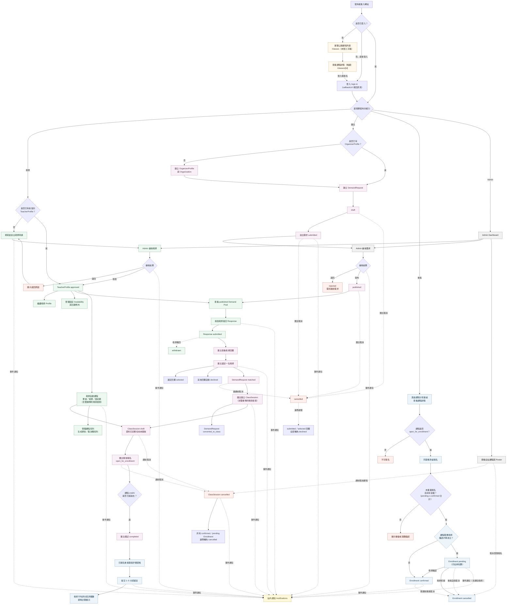
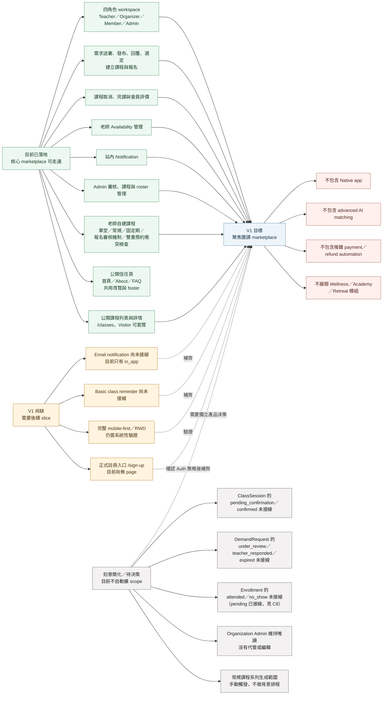

# Current Functional Architecture 現行網站功能架構

## 文件目的

本文件整理 Free Soar Yoga Marketplace **目前 repository 已落地**的網站功能架構、跨角色核心流程，以及目前實作與 V1 目標之間的差距。

本文件是現況導覽，不取代以下 source of truth：

- route 與 route guard：`docs/product/route-map.md`
- 角色與權限：`docs/domain/roles.md`、`docs/domain/permissions-matrix.md`
- marketplace 狀態：`docs/domain/state-machines.md`、`docs/domain/state-transition-details.md`
- 資料模型：`docs/domain/data-model.md`、`prisma/schema.prisma`
- V1 範圍：`docs/scope/v1-scope.md`、`docs/scope/non-goals.md`

盤點基準日期：**2026-08-07**（`teacher-initiated-open-classes` 落地後更新）。

圖中只將 `src/app` 實際存在的正式 page route 與已接線 domain flow 視為現況；`/dev/*` 測試 route 不納入產品功能。規劃文件中存在、但 repository 尚無對應 page 或 transition 的項目，列在差距圖而不畫成已落地能力。

## 目前網站功能架構圖

```mermaid
flowchart TB
    SITE["Free Soar Yoga Marketplace"]

    SITE --> PUB["公開入口"]
    SITE --> COMMON["共用帳號功能"]
    SITE --> TEACHER["老師工作區"]
    SITE --> ORGANIZER["團主工作區"]
    SITE --> MEMBER["會員工作區"]
    SITE --> ADMIN["平台管理工作區"]

    subgraph Public["公開入口"]
        P1["首頁<br/>/"]
        P5["關於我們<br/>/about"]
        P6["常見問題<br/>/faq"]
        P2["老師加入／申請<br/>/teachers/join"]
        P3["團主需求介紹入口<br/>/organizers/request"]
        P4["登入<br/>/sign-in"]
        P7["公開課程瀏覽<br/>/classes（含詳情頁）"]
    end

    subgraph Common["共用帳號功能"]
        C1["帳號資料<br/>/account"]
        C2["站內通知<br/>/notifications"]
        C3["NextAuth 身分驗證"]
        C4["同一 User 可具備<br/>Member／Teacher／Organizer 能力"]
    end

    subgraph Teacher["老師工作區"]
        T1["老師 Dashboard<br/>申請與審核狀態"]
        T2["老師 Profile<br/>資料編輯／評分摘要"]
        T3["Availability<br/>固定時段與例外日期"]
        T4["Demand Pool<br/>查看合資格需求"]
        T5["Demand Response<br/>提案／撤回／被選定"]
        T6["我的課程<br/>課程與學員名單<br/>（含來源徽章／pending 報名確認）"]
        T7["自建課程<br/>單堂／常規／固定期"]
        T8["課程系列管理<br/>生成更多／取消整系列"]
    end

    subgraph Organizer["團主工作區"]
        O1["團主 Profile<br/>建立 Organization"]
        O2["團主 Dashboard<br/>需求與近期通知"]
        O3["需求管理<br/>建立／編輯／送審／取消"]
        O4["老師回覆<br/>查看並選定老師"]
        O5["課程管理<br/>建立／開放報名／取消／完課"]
        O6["課程評價<br/>查看會員評價"]
    end

    subgraph Member["會員工作區"]
        M1["會員 Dashboard<br/>通知與即將到來課程"]
        M2["課程詳情<br/>/classes/[classSessionId]<br/>（登入分支，見下方公開入口）"]
        M3["課程報名<br/>容量與重複報名檢查<br/>（可能落在 pending 待老師確認）"]
        M4["我的報名<br/>查看／課前取消（含 pending）"]
        M5["完課評價<br/>評分與留言"]
    end

    subgraph Admin["平台管理工作區"]
        A1["Admin Dashboard<br/>待審事項與 Basic KPIs"]
        A2["老師管理<br/>核准／退回／暫停／恢復"]
        A3["需求管理<br/>發布／退回"]
        A4["Organization<br/>唯讀查看"]
        A5["課程管理<br/>全站課程／取消課程"]
        A6["Enrollment 管理<br/>Roster／取消單筆報名"]
    end

    PUB --> P1
    PUB --> P5
    PUB --> P6
    PUB --> P2
    PUB --> P3
    PUB --> P4
    PUB --> P7

    COMMON --> C1
    COMMON --> C2
    COMMON --> C3
    COMMON --> C4

    TEACHER --> T1
    TEACHER --> T2
    TEACHER --> T3
    TEACHER --> T4
    TEACHER --> T5
    TEACHER --> T6
    TEACHER --> T7
    TEACHER --> T8

    ORGANIZER --> O1
    ORGANIZER --> O2
    ORGANIZER --> O3
    ORGANIZER --> O4
    ORGANIZER --> O5
    ORGANIZER --> O6

    MEMBER --> M1
    MEMBER --> M2
    MEMBER --> M3
    MEMBER --> M4
    MEMBER --> M5

    ADMIN --> A1
    ADMIN --> A2
    ADMIN --> A3
    ADMIN --> A4
    ADMIN --> A5
    ADMIN --> A6

    C3 -. "身分與權限檢查" .-> TEACHER
    C3 -. "身分與權限檢查" .-> ORGANIZER
    C3 -. "身分與權限檢查" .-> MEMBER
    C3 -. "Admin-only" .-> ADMIN

    T5 --> C2
    O3 --> C2
    O4 --> C2
    O5 --> C2
    M3 --> C2
    M5 --> C2
    T7 --> T8
    P7 -. "未登入唯讀＋登入後報名導引；<br/>已登入沿用既有報名流程" .-> M2

    classDef public fill:#fff8ed,stroke:#c99855,color:#35281c
    classDef teacher fill:#edf8f1,stroke:#55996d,color:#173c24
    classDef organizer fill:#f8f0f6,stroke:#aa7299,color:#4a2340
    classDef member fill:#edf5fb,stroke:#668eaa,color:#173448
    classDef admin fill:#f3f1f1,stroke:#777,color:#222
    classDef shared fill:#fffdf8,stroke:#9b8a70,color:#342f27

    class P1,P2,P3,P4,P5,P6,P7 public
    class T1,T2,T3,T4,T5,T6,T7,T8 teacher
    class O1,O2,O3,O4,O5,O6 organizer
    class M1,M2,M3,M4,M5 member
    class A1,A2,A3,A4,A5,A6 admin
    class C1,C2,C3,C4 shared
```

## 目前核心功能流程圖

## 目前實作與 V1 目標差距圖

這張圖將差距分成兩類：

- **V1 尚缺**：現有 V1 scope 或 route map 已明確要求，但目前 repository 尚未完整落地。
- **已刻意簡化／待決策**：已有 enum、資料或未來設計，但目前沒有 transition、公開 route 或自動整合；不應未經 product owner 核准就視為下一輪必做。

## 現況判讀重點

- Public routes `/`、`/about`、`/faq` 已落地，並共用公開導覽與 footer；首頁僅提供 Teacher／Organizer 的主要 CTA。**`/classes` 公開瀏覽已落地**（`teacher-initiated-open-classes` Slice D 已確認），Visitor 可瀏覽公開課程列表與唯讀詳情，不需要登入。
- 所有登入者都有基本 Member capability；同一帳號可另外建立 Teacher 或 Organizer capability。
- Teacher 必須為 `approved` 才能回應新需求，也必須在選定當下仍維持 `approved`；**已擴充**：`approved` 老師現在也能不經團主媒合，直接自建單堂／常規／固定期課程（`teacher-initiated-open-classes` 已確認）。
- DemandRequest 的現行 Admin 審核直接使用 `submitted → published | rejected`，跳過 `under_review`。
- DemandResponse 在 V1 只允許同一需求選定一位老師；選定時其餘有效回覆自動轉為 `declined`。
- ClassSession 現行主線為 `(none) → draft → open_for_enrollment → completed`；`draft` 與 `open_for_enrollment` 可在課前取消。**已擴充**：不論建立來源（團主媒合或老師自建），任何建課動作都會檢查同一位老師是否被同時排了時段重疊的其他課程（雙重預約衝突檢查，硬擋）。
- 課程取消會連帶取消其下所有 `confirmed`／`pending` Enrollment；DemandRequest 取消則會連帶 decline 其下尚有效的老師回覆。
- Enrollment 建立時**依課程設定**成為 `confirmed`（既有行為）或 `pending`（新——課程設定「需要老師確認」時），並原子檢查容量（`pending`＋`confirmed` 合計）與重複報名；課程開始後不可自助取消，`pending` 報名也受同一時間限制。老師可在自己課程的報名清單確認或拒絕 `pending` 報名。
- 評價只開放給已完成課程中仍為 `confirmed` 的報名者，每位使用者每堂課只能提交一次。
- 通知目前只接線 `channel="in_app"`；`email`、`line`、`sms` 是 reserved enum，不能解讀成已提供的功能。
- TeacherAvailability 與 AvailabilityException 已能維護，但目前不會在媒合或 ClassSession 建立時自動阻擋排程衝突（這與上方「雙重預約衝突檢查」是不同機制——後者比對的是同一位老師的其他 `ClassSession` 時段，不是 `TeacherAvailability` 宣告的可授課時段；老師自建課程會提示自己宣告的可授課時段，但不強制限制在該時段內建課）。

## 維護規則

以下情況發生時，應在同一變更中更新本文件：

- 新增、刪除或改名正式 page route。
- 修改 role、route guard、own-scoped permission 或 Admin capability。
- 接上新的 marketplace state transition。
- 新增會改變跨角色流程的 Notification、Email 或排程整合。
- V1 scope 或 non-goal 發生 product owner 核准的變更。

若本文件與 domain 或 product source of truth 發生矛盾，應先以對應的 source of truth 為準，再修正本文件，不應用本概覽圖反向覆蓋尚未核准的產品決策。
