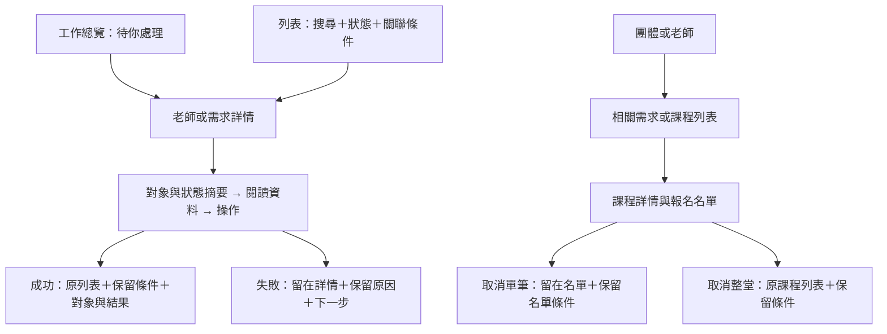

# Admin Usability Redesign Spec／管理後台第二輪使用流程規格

日期：2026-10-03。狀態：Q1–Q20 與完整方案已確認，第一批已授權並依四票實作；本文件也包含尚未啟動的第二至四批，不能將全部設計視為已落地。

來源：`docs/admin-usability-plan.md` 第二輪決策。分批計畫：`docs/superpowers/plans/2026-10-03-admin-usability-redesign-plan.md`。

## 1. 目標與範圍

優先順序是判斷清楚 → 找資訊快 → 日常處理快。電腦與手機都須能完成全部日常操作；沿用團主、老師、學員端清楚的狀態、列表與詳情習慣。

本輪包含工作總覽、老師與需求審核、課程與報名管理、團體唯讀資料、各列表基本搜尋、關聯導覽、操作回饋與 RWD。必要時取代前次資訊順序與返回流程。

不做管理員指派／權限設定（`docs/backlog.md` 第 17 項）、全站學員搜尋、批次審核、匯出、操作紀錄、付款／退款、AI matching、原生 app 或 Wellness／Academy／Retreat 模組。不接通 email 服務，不新增或承諾審核時效。

## 2. 保持的 domain 邊界

| 項目 | 本輪規則 |
| --- | --- |
| 管理員判斷 | 維持 `User.isAdmin` 與 `requireAdmin()`；頁面、讀取及 action 各自保留 server-side guard，非 admin 頁面仍回 404。 |
| 老師／需求草稿 | 管理員不可讀；搜尋、計數、關聯入口不得放寬此排除。團體相關需求數也須遵守同一可見範圍。 |
| 老師審核 | 維持 submitted → approved/rejected、approved ↔ suspended；退回及暫停原因維持 trim 後 10–1000 字。 |
| 需求審核 | 維持 submitted → published/rejected；rejected 為終局，團主須另建需求。Admin 不代選老師或代建課。 |
| 課程取消 | 維持 draft／open_for_enrollment 且未開始；連帶取消 pending／confirmed 報名，不能恢復。 |
| 報名取消 | 維持 pending／confirmed 且未開始；同一學員不可重報同一場。補 pending UI 入口，不增加 admin 確認報名能力。 |
| 原因／通知 | 課程與報名取消不新增原因欄位。沿用既有站內通知及失敗處理，不把通知失敗描述為取消失敗或 email 已寄出。 |
| Schema／Auth | 不新增 migration、不變更 schema／Auth／角色與 permission model；只在既有可見資料內補窄 DTO 與讀取條件。 |

關聯 id 只用於精準定位與篩選，不能作為授權依據。新讀取或 DTO 必須維持 admin-only；報名姓名／email 不送入公開或其他角色的共用 DTO。

## 3. 導覽與 route

| 導覽文字 | 既有 route | 用途 |
| --- | --- | --- |
| 工作總覽 | `/admin/dashboard` | 每日待審入口與次要統計。 |
| 老師 | `/admin/teachers` | 搜尋／篩選，進老師詳情審核或管理狀態。 |
| 需求 | `/admin/demands` | 搜尋／篩選，進需求詳情審核或追查成案。 |
| 課程與報名 | `/admin/classes` | 搜尋課程，進課程詳情與報名名單。 |
| 團體 | `/admin/organizations` | 唯讀聯絡資料與相關需求／課程入口。 |

沿用現有三種 detail route。沒有新增 admin 學員、報名、團主或團體詳情 route。角色切換沿用既有已具備身分的連結，不增加授權功能。共用元件若需調整，只允許本輪需要的相容擴充，不改其他角色流程。

## 4. 主要使用流程

從總覽進入詳情時，沒有來源列表條件，成功回對應待審列表；從列表進入則保留該列表上下文。從關聯列表進入時，返回與操作結果也保留該關聯條件。

## 5. 共用列表與搜尋

頁面順序：標題與用途 → 操作結果 → 搜尋與關聯條件 → 狀態分類 → 結果數 → 列表或空狀態。

| 列表 | 基本搜尋欄位 |
| --- | --- |
| 老師 | 顯示名稱、帳號姓名、email。 |
| 需求 | 標題、團體名稱、團主名稱、聯絡人、聯絡 email。 |
| 課程 | 標題、老師名稱、團主名稱、團體名稱、地點。 |
| 團體 | 名稱、聯絡人、聯絡 email、團主名稱。 |

按搜尋或 Enter 執行；切換分類保留已送出的關鍵字與關聯條件。狀態分類數量先套用搜尋及關聯條件，再按狀態計數；結果數是當前分類的筆數。空關鍵字視為未搜尋。無結果顯示條件、「清除關鍵字」與「清除全部條件」；後者解除搜尋／關聯限定並回該列表預設分類。

老師分類：待審／已通過／已暫停／已退回／全部，預設待審。需求分類：待審／已公開／已媒合／已建課／已退回／已取消／全部，預設待審；只映射已落地狀態。課程預設全部，保留已落地分類；團體不創造待審狀態。

排序：老師／需求待審依現有送審列表使用的更新時間，最久優先；其他分類最近更新優先。課程先未來場次（開始時間升冪），再歷史場次（開始時間降冪）；以開始時間判斷，不把未來草稿或已取消場次稱為即將上課。團體按名稱排序。

上下文解析須驗證 route 與允許的 query 值；只接受站內 admin 路徑，不能直接信任表單中的任意 return URL。無效條件安全回退，不能繞過 guard、造成外部 redirect 或跨角色跳頁。

## 6. 跨資料導覽

| 起點 | 目的 |
| --- | --- |
| 團體 | 以 organization id 限定的需求／課程列表。 |
| 老師詳情 | 以 teacher profile id 限定的課程列表。 |
| 需求詳情 | 存在已成立課程時，直接進該課程詳情。 |
| 課程詳情 | 授課老師詳情、存在時的來源需求，以及限定到所屬團體的團體列表。 |

關聯資料不存在或不可見時，不渲染死連結或暴露隱藏紀錄。限定列表顯示可辨識的對象名稱與解除入口；不可用名稱匹配代替 id。團體的需求數不能包含 admin 不可讀的草稿並暗示其可查看。

## 7. 詳情與審核

共用順序：回列表 → 對象、狀態、時間與摘要 → 重要內容 → 次要資料／關聯 → 操作區。有合法操作時，摘要提供「前往審核操作」或對應的頁內跳轉，不重複放整套表單。

老師：教學經歷、簡介、教學風格、擅長、服務地區、授課形式優先；聯絡方式清楚分組，證照與偏好等次要資料可收合，但不能遺失原可讀資訊。評價沿用既有呈現。

需求：清楚呈現對象、人數、時間、地點、頻率、預算、需求說明與團體／團主聯絡資料。已處理狀態顯示結果與相關資料，不再出現不合法審核動作。退回提示說明須另建需求。

課程：時間、地點、老師、來源與報名摘要優先；補讀現有 `serviceTypes`／`yogaStyles`／`origin`／`requiresApproval` 並呈現 `isPublic`。使用既有兼容讀取規則處理舊資料；不改 schema、課程建立或編輯能力。用詞統一為「課程風格」「瑜伽類型」；課程來源與團主端共用同一份管理員用詞（`classOriginLabelsForAdmin`：團主媒合／老師開課／團主直接開團），不認得的來源顯示「其他來源」（2026-10-06 產品主人選擇，取代原本的「團主團課／老師開課」）。

## 8. 報名名單與操作

名單維持在課程詳情。顯示姓名與 email，提供姓名／email 搜尋及全部／待老師確認／已報名／已取消分類與數量。confirmed 與 pending 數量分開；既有名額規則仍將 pending＋confirmed 計入佔用，不以 confirmed 數量宣稱剩餘名額。若有其他歷史狀態，沿用可讀資料並清楚標示，不新增出席管理動作。

取消單筆後留在名單，保留其搜尋與分類。若該筆已離開原分類，結果提示指明學員與狀態，提供可追查該筆結果的入口。取消整堂則回原課程列表。所有取消仍依 server service 當下資格檢查，頁面不能僅靠先前載入的時間或狀態決定。

| 操作 | 互動與回饋 |
| --- | --- |
| 通過／公開／恢復 | 一鍵送出，處理中停用並顯示處理狀態。 |
| 退回 | 點退回才展開可編輯原因；清楚說明對方看得到，必填規則不變。 |
| 暫停 | 必填原因，再確認老師名稱及影響；不宣稱既有課程會一併取消。 |
| 取消整堂 | 確認課程名稱、連帶報名影響與不可恢復的後果。 |
| 取消單筆 | 確認課程與學員、不可恢復且同學員不可重報同一場。 |
| 失敗／資格已變 | 留當前詳情，保留已填原因，說明發生原因與下一步；不能顯示成功或讓過期資格繼續操作。 |

回饋需含操作對象、結果與追查入口；不把提示文字當作授權或已完成操作的證明。本輪不順帶建置一次性 flash 儲存機制（backlog 13c）。輸入保留不得靠把退回／暫停原因放入 URL。

## 9. 已確認的退回範本

範本一鍵帶入，可再修改；不能強制涵蓋所有原因。

| 類別 | 名稱 | 文字 |
| --- | --- | --- |
| 老師 | 教學經歷 | 請補充帶領團課的實際經驗與教學年資，讓我們更了解你的教學背景；補充後歡迎重新送審。 |
| 老師 | 簡介與風格 | 請多描述你的課程特色、教學方式與適合的學員；補充後歡迎重新送審。 |
| 老師 | 資料不清楚 | 部分申請資料尚不清楚，請確認擅長類型、服務地區與授課形式，補充後重新送審。 |
| 需求 | 說明不足 | 請另建一筆需求，補充上課對象、人數與希望呈現的課程樣貌後送審，讓老師更容易評估。 |
| 需求 | 安排不明 | 請另建一筆需求，說明可配合的時段、地點與預算範圍後送審，讓老師判斷是否能配合。 |
| 需求 | 聯絡資料 | 請先確認團體的聯絡人與聯絡方式，再另建一筆需求送審，方便後續聯繫。 |

## 10. 工作總覽

待你處理在最上方：老師與需求各前 5 筆及總數，依現有待審更新時間最久優先，直接進詳情；無待辦時顯示明確空狀態。數字概況次之。

| KPI | 精準目的 |
| --- | --- |
| 已通過老師 | approved 老師分類。 |
| 已公開需求 | 只對應 published，不包含未接線的 teacher_responded。 |
| 已媒合需求 | 只對應 matched，不含 converted_to_class。 |
| 即將開始課程 | open_for_enrollment 且 startAt 尚未到達；列表須顯示此時間條件並可清除。 |
| 已確認報名 | 純全平台 confirmed 統計，不新增全站報名路由或近似目的頁。 |

同一次資料快照應有一致數字與條件；點擊後若資料隨時間或其他管理員操作改變，以當下有效資料為準。

## 11. 品牌、RWD 與驗收

沿用品牌色、字型、共用頁寬與元件；清楚、留白、溫和且專業。桌機緊湊列表、手機單欄卡片，順序與功能一致；首屏優先對象、狀態、摘要與跳轉。必要內容長時自然換行，不以縮字或截斷隱藏關鍵資訊；不做固定底部審核按鈕。

- 在 1280px desktop 與 390px mobile 完成老師／需求審核、資料查找、關聯導覽、課程與報名取消。
- 工作總覽一次點擊抵達任一可見待審詳情；有關聯時一次點擊抵達對應資料或限定列表。
- 搜尋、狀態與關聯條件可組合；計數正確，無結果可清除，返回及重新整理不遺失已送出的列表條件。
- 恢復／暫停／退回後資料離開分類時，提示仍可辨識並追查對象。
- 報名取消留在名單並保留條件；課程取消回原課程列表。
- 失敗保留原因；送出中避免重複送出。確認視窗可用鍵盤及手機操作，焦點、關閉與返回可用。
- 列表與長內容沒有頁面橫向溢出、遮擋操作或不可辨識的同名對象。
- 非 admin 頁面／讀取／action 仍被擋，草稿不因搜尋或關聯而出現；狀態、開始時間邊界、名額與不可重報規則不變。

本文件是設計與待驗收規格，不是測試通過、畫面驗收或上線聲明。不新增 ADR：本輪是在既有 domain 邊界內可逆的資訊與互動調整；若實作遇到不可逆架構取捨，另提選項與影響。

## 12. 設計樹與確認狀態

| 分支 | 決策來源 | 結果 |
| --- | --- | --- |
| 範圍與優先目標 | Q1–Q3 | 營運後台，必要時重新安排架構，判斷 → 查找 → 效率。 |
| 導覽與查找 | Q5–Q6 → Q9–Q11、Q18 | 五區導覽、四列表搜尋、精準關聯、完整已落地分類與明確計數／清除規則。 |
| 詳情與結果 | Q7–Q8 → Q12–Q13、Q15、Q17、Q19 | 先閱讀再操作，保持返回條件，名單例外，完整既有資料、可恢復輸入與正確退回文案。 |
| 雙裝置 | Q4 → Q14、Q20 | 相同功能與資訊順序、不同密度，每批均檢查 desktop/mobile。 |
| 工作起點與驗收 | Q16、Q20 | 待辦優先、精準 KPI、四批且每批產品主人看畫面。 |

訪談 frontier 已收斂，Q1–Q20 與完整方案均已確認。產品主人回覆「1」選擇現有 task 執行第一批，並以「照這 4 票切」確認票券。後續依四批計畫執行，每批仍需產品主人看過畫面才進下一批；不能把此文件自身的狀態文字當作人類授權。

<!-- codex-peer-reviewed: 2026-10-05T21:19:50Z rounds=2 verdict=approved -->
